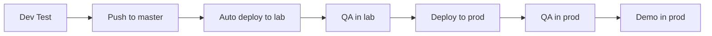

## From dev branches to "more continuous" integration

### The old state

---

### Problems

* engineers stepping on each other's toes
* taking several weeks to have a story in a releasable state
* stories moving slowly through the pipeline
* bugs were lingering in the code for weeks 
* sometimes we forgot to
   * merge to master after demo
   * deploy to prod after demo or we were waiting for few more days – we lose context
   * test in production after the merge - sometimes made us miss problems specific to production env or breaking changes when integrating 2 tracks which were fine independently
* more frequent merge conflicts

---

<!-- _class: smaller-text -->

### The new state

* engineer / pair pulls a feature / bug fix
* decide whether the change should be pushed directly to master (default) or to a dev branch
* take the necessary precautions to feature flag / shadow deploy
* build, run tests locally
* push code to master
* code ready to be deployed on the next deploy cycle - Continuous Delivery
* after enough testing, the feature flag is turned on
* QA
* prod deploy
* demo in prod

---

### Exceptions

* branches are still fine to use, it's feature branches living for multiple days which are not be the default choice
  * special cases for feature branch - e.g. changes with financial impact that we want to test with production data
* we aim for push to master at least once a day, we exercise judgment if end of day and change is not ready
* local commits are fine for a short interval

---

<!-- _class: smaller-text -->

### Things to consider for continuous integration

* single team repo or multi teams repo
    * anything pushed to master of a multi-team repo is fair game, it can be released at any time by another team – before the QA phase
* desired frequency of releases - ability to do multiple releases per day is nice
* small team vs large team
* increased code complexity because of feature flagging (trade-off between the complexity in managing branches with complexity in the code)
* the feature flag approach works well with some types of work (e.g. a new form) but less well with others (bug fixes) 
* when using feature flags, they need to be left in the code up to the end of the QA stage, and then the flag needs to be tracked for removal
* continuum between the example Martin Fowler gave with integration before release at one end and pushing everything to master every few minutes at the other. Optimum would differ by situation.
* the half-continuous integration (merging master to the dev branch) may be insufficient, see resources section for more context
* develop the habit to run build and unit tests before pushing
* builds need to be monitored closely, as soon as the build is broken we need to fix/revert
* develop skills to feature flag and shadow deploy
* develop skills to automate more of the testing
    * more integration testing
    * canary testing
    * automated frontend testing?
    * look at each testing step we do in dev testing as a candidate for automation
* pair programming becomes important
    * this helps with immediate code reviews, minimizes bugs

---

## "What if we break production?"

* Unit tests
* Pair programming for complex changes
* Code review for solo work
* Feature flags for instant rollback
* Canary deployments
* Real-time monitoring and alerting

---

## Conclusion

* we are happy with the new state
  * less manual steps
  * deployment frequency: weekly -> daily
  * story lead time: 1-2 weeks -> 2-3 days
  * no noticeable increase in problems
* give Continuous Integration a try if you are not doing it already
* try Continuous Delivery and Continuous Deployment next, find works for your situation
* retrospect and adjust

---

## Learning Resources

* https://www.youtube.com/watch?v=v4Ijkq6Myfc - Continuous Integration vs Feature Branch Workflow
    * Dave Farley talks about the paradigm difference and techniques such as feature flagging, branch by abstraction, and dark launch
* https://www.youtube.com/watch?v=NcU0oEk6z8Y - The 10 COMMANDMENTS Of Continuous Integration (CI)
    * Dave Farley talks about steps like running tests, watching the build for failures
* https://martinfowler.com/articles/continuousIntegration.html

